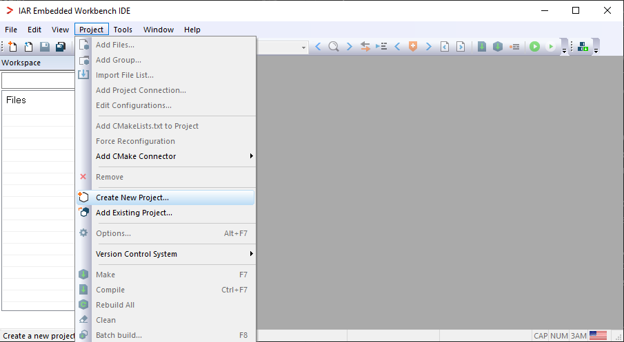
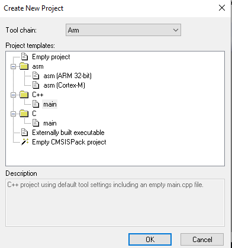
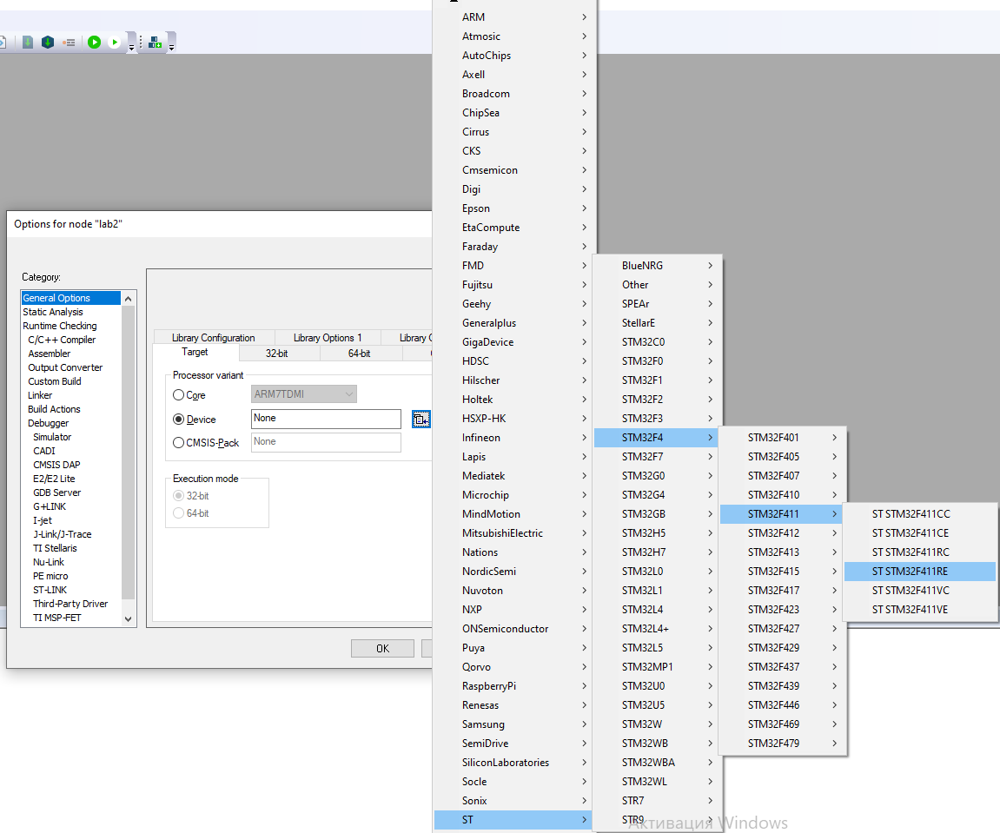
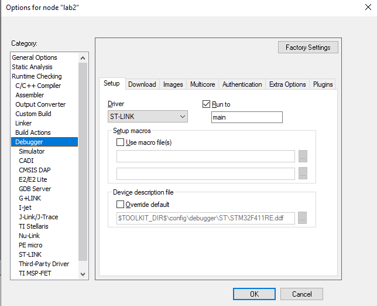

= Лабораторная работа 2

== Знакомство с IAR Embedded Workbench

== Жуламанова Арина Маратовна КЭ-413

=== Цель работы:

Ознакомиться с работой IAR Embedded Workbench. А также создание и настройка файла.

<<<

== Оглавление:
. Среда разработки программ для микроконтроллера;
. Состав интеграционной среды разработки IAR Workbench;
. Трансляция кода;
. Компоновка кода;
. Запуск и отладка;
. Запуск программного обеспечения;
* Инициализация стека;
* Инициализация переменных в нулевые значения;
* Инициализация переменных;
* Запуск функции main();
* Использование С++;
. Создание проекта и работа в IAR Workbench;
* Выбор шаблона проекта;
* Выбор микроконтроллера;
* Выбор внутрисхемного отладчика

<<<

==Среда разработки программ для микроконтроллера

В учебных целях мы будем использовать интегрированную среду разработки IAR Workbench for ARM. 

Еще каких-то 10-15 лет назад для создания простейших программ, минимально необходимым набором инструментального ПО являлись: текстовый редактор, транслятор ассемблерного кода и симуляторы для отладки. С развитием микропроцессоров, с ростом объема оперативной памяти и памяти программ и широчайшим распространением МК в различных областях техники, а также требований к надежности и качеству разрабатываемого программного обеспечения минимального набора стало не хватать.

Для создания качественных программ и повторного использования уже отлаженного кода, в виде библиотек, появились редакторы связей (линковщики, компоновщики), появились отладчики, и более совершенные трансляторы и, наконец, стало возможным и обоснованным применение компиляторов (примерно с середины 90-х прошлого века), появился диалект Embedded C\C++. И все эти средства для удобства использования стали объединять в один программный продукт - так появились интегрированные среды разработки (IDE) и целая отрасль разработки ПО. Одними из лидеров в этой области являются фирмы IAR Systems."

== Состав интеграционной среды разработки IAR Workbench

Процесс разработки программного обеспечения в общем случае ничем не отличается от процесса
разработки приложения для обычных компьютеров, который включает в себя проектирование (Design),
разработка кода(Develop), отладка(Debug)

image::mng1.png[]
Рисунок 1 - Процесс разработки с точки зрения IAR Workbench

== Процесс создания исполняемого образа

Процесс преобразования кода на языке программирования высокого уровня С++ в файл, содержащий образ
исполняемой программы, готовый для прошивки в микроконтроллер можно разделить на два этапа:

* Трансляция кода в объектный файл
* Компоновка кода в исполнительный файл

== Трансляция кода

Трансляцию кода выполняет компилятор. После трансляции вы можете получить на выходе либо  файлы
библиотеки, которые впоследствии можно будет использовать в других проектах, либо объектные файлы.

image::mng2.png[]
Рисунок 2 - Схема процесса трансляции

== Компоновка кода

Компоновку кода выполняет линковщик. На входе линковщика могут быть, внешние библиотеки, полученные на этапе трансляции в других проектах и программах, объектные файлы полученные на предыдущем этапе,стандартные(встроенные) библиотеки С++, и конфигурационный файл, описывающий настройки по размещению кода и данных в адресном пространстве микроконтроллера. Компоновщик создает исполняемый файл, который можно запустить на микроконтроллере.

image::mng3.png[]
Рисунок 3 - Схема процесса компоновки

== Запуск и отладка

Последний этап - отладка. Компоновищик IAR создает файл в формате ELF, который содержит исполняемый образ программы. Этот файл может быть использован для:

* Загрузки в систему отладки IAR-CSPY или в любой другой отладчик, например GDB, способный читать ELF формат

* Загрузки образа в ПЗУ микроконтроллера используя программатор.

image::mng4.png[]
Рисунок 4 -  Возможные варианты использования выходного файла
    
== Запуск программного обеспечения

Функция int main() является точкой входа программы, для пользователя программа начинается с вызова этой функции и выполнения тела это функции. Однако на самом деле, еще до функции main() микроконтроллер выполняет множество различных действий, например, инициализацию стека, глобальных переменных, констант.

=== Инициализация стека

Сразу после подачи питания происходит инициализации указателя стека на конечный адрес стека.

image::mng5.png[]
Рисунок 5 - Стадия инициализации стека

=== Инициализация переменных в нулевые значения

После подачи питания на микроконтроллер, регистр адреса команды указывает на 0 адрес, микроконтроллер начинает работу с адреса 0. По адресу 0, находится таблица векторов перываний, по начальному вектору находится команда инициализации указателя стека на конечный адрес стека и далее перехода на функцию инициализации.

После подачи питания и инициализации стека, выполняется функция инициализации памяти нулями (данные указанные как zero-initialized data, непроинциализированные глобальные переменные, такие как int i;)

image::mng6.png[]
Рисунок 6 - Стадия инициализации непроинициализированных переменных

=== Инициализация переменных

Далее должна произойти инициализация данных определенных как initialized data,например int i = 6. Значения инициализации для каждой переменной будут скопированы из ПЗУ в ОЗУ.

image::mng7.png[]
Рисунок 7 - Стадия инициализации проинициализированных переменных

=== Запуск функции main()

Завершающий этап – это вызов функции main().
image::mng8.png[]
Рисунок 8 - Стадия запуска функции main()

=== Использование С++

Так же как когда-то Си пробивал себе дорогу в качестве стандарта для встроенного ПО, так и язык С++ уже вполне может заменить Си в этой области.

Язык программирования стандарта С+ + и современные компиляторы имеют достаточно средств для того чтобы создавать компактный код и не уступать по эффективности коду, созданному на Си, а благодаря нововведениям быть понятнее и надежнее.. Начиная с версии IAR Workbench 8.40 компилятор поддерживает полезные нововведения стандарта С++17, такие, как например “структурные привязки”, “инициализация в ветвлениях”, “встроенные переменные”.

С++ является строго типизированным языком, а значит программы написанные на нем более безопасны, чем программы написанные на Си и меньше вероятность того, что программист допустит ошибку.

С++ является языком программирования полностью поддерживающий парадигму программирования ООП, которая отлично подходит для разработки программного обеспечения измерительных устройств.

Ведь нужно понимать, что для измерительного устройства нам нужно описать логику работы, интерфейс взаимодействия с пользователем, реализовать расчеты, а не помнить, что для того чтобы считать данные с АЦП, нужно вначале его выбрать с помощью сигнала CS, находящегося на порту GPIOA.3 и установить его в единицу. Этим должен заниматься разработчик драйверов.

Большинство драйверов для работы с аппаратурой уже реализованы производителями микроконтроллеров, например, в библиотеках CMSIS и CMSIS_HAL, ими можно воспользоваться для обращения к функциям доступа к аппаратуре, упростить и ускорить разработку.

Замечаниями по этому поводу может служить то, что эти библиотеки довольно громоздкие и для использования в небольших приложениях вряд ли подойдут, кроме того, не всегда они имеют необходимые сертификаты надежности, а потому при разработке реальных измерительных устройств, применение которых планируется в местах с повышенной безопасностью промышленных предприятиях, вряд ли стоит пользоваться этими библиотеками.

Именно поэтому, мы будет использовать С++ от написания драйверов и уровня аппаратуры и до реализации логики работы с пользователем. Начнем же изучение с создания проекта, системы тактирования и небольшой программы мигания светодиодом.

== Создание проекта и работа в IAR Workbench

* Создать новый проект Project⇒Create New Project.

Рисунок 9 - Создание нового проекта

=== Выбор шаблона проекта

Выбирать шаблон проекта( ProjectTemplates): C++ - main

Рисунок 10 - Выбор шаблона проекта

=== Выбор микроконтроллера

Рисунок 11 - Выбор микроконтроллера

=== Выбор внутрисхемного отладчика

Рисунок 12 - Выбор внутрисхемого отладчика

== Конец

