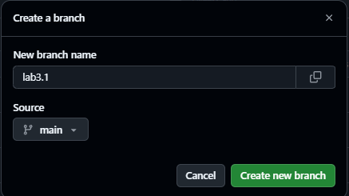
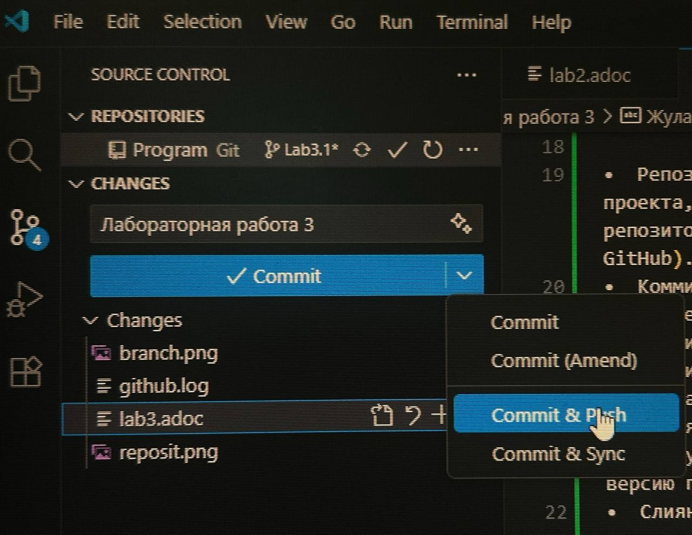
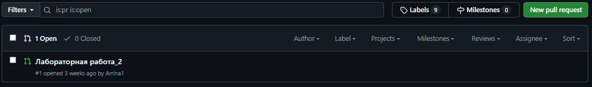

= Лабораторная работа 3

== Работа с GitHub

== Жуламанова Арина Маратовна КЭ-413

<<<

=== Оглавление:
* 1. Введение;
* 2. Ключевые концепции GitHub и Git;
* 3. Рабочий процесс: От идеи до публикации на GitHub;
* 4. Заключение.

=== 1. Введение

GitHub – это веб-сервис для хостинга IT-проектов и их совместной разработки, основанный на системе контроля версий Git. Он предоставляет мощные инструменты для отслеживания изменений в коде, координации работы команды и управления проектами. Использование GitHub критически важно для эффективной совместной разработки, обеспечения целостности проекта и возможности возврата к предыдущим версиям. Данный отчет описывает основные принципы работы с GitHub, фокусируясь на создании веток, фиксации изменений и отправке текстовых документов формата AsciiDoc (.adoc) из интегрированной среды разработки Visual Studio Code.

=== 2. Ключевые концепции GitHub и Git

Прежде чем перейти к практическим шагам, важно понимать основные термины:

•  Репозиторий (Repository): Место хранения всех файлов проекта, включая историю изменений. Существует локальный репозиторий (на вашем компьютере) и удаленный репозиторий (на GitHub).
•  Коммит (Commit): "Снимок" текущего состояния проекта в определенный момент времени. Каждый коммит содержит сообщение, описывающее внесенные изменения, и уникальный идентификатор.
•  Ветка (Branch): Независимая линия разработки, ответвляющаяся от основной. Ветки позволяют разрабатывать новые функции или исправлять ошибки, не затрагивая стабильную версию проекта.
•  Слияние (Merge): Процесс объединения изменений из одной ветки в другую.
•  Запрос на слияние (Pull Request, PR): Предложение объединить изменения из вашей ветки в основную (или другую) ветку. PR – это центральный механизм для рецензирования кода и обсуждения изменений в команде.
•  Push: Отправка зафиксированных изменений из локального репозитория в удаленный репозиторий на GitHub.
•  Pull/Fetch: Загрузка изменений из удаленного репозитория в локальный.

=== 3. Рабочий процесс: От идеи до публикации на GitHub

• Для начала работы необходимо создать репозиторий и клонировать его на ПК.

• Далее следует создать ветку на GitHub

• В локальной ветке на вкладке Explorer в VS Code мы создаем файл(ы) проделываем все необходимые махинации с их наполнением, а потом переходим на вкладку Source Control, чтобы отправить коммит на GitHub. Обязательно создать сообщение к коммиту! Теперь
можно отправлять.

• Следующий этап - дать понять проверяющему, что он проверяющий и должен что-то проверить.

Для этого во вкладке Pull Requests выбираем New Pull Requests, выбираем что именно мы хотим отправить из нашей ветки в главную (main) сравнить изменения (compare changes) и нажимаем Create Pull Requests. 

• Добавлаяем коллаборатора как Reviewer и снова нажать создать PR.

После проделанной работы стараемся и ждем ответа.

=== 4. Заключение

GitHub в сочетании с Git и Visual Studio Code представляет собой мощный инструментарий для управления версиями и совместной разработки. Использование веток позволяет безопасно экспериментировать и разрабатывать новые функции, не нарушая основную кодовую базу. Процесс коммитов, пушей и запросов на слияние обеспечивает прозрачность, возможность рецензирования и контроль качества. Для текстовых документов AsciiDoc (.adoc) этот процесс столь же эффективен, позволяя командам совместно работать над документацией, статьями или книгами, сохраняя полную историю изменений и легко управляя различными версиями.
