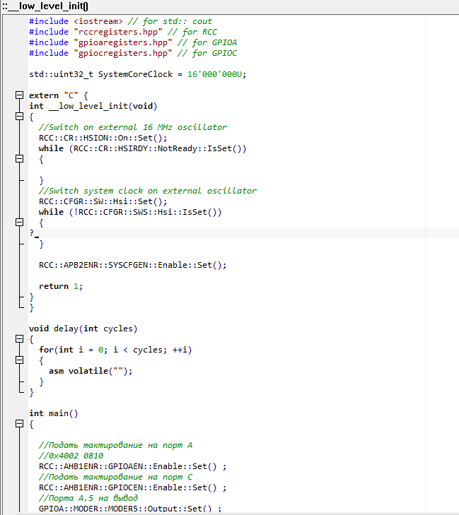
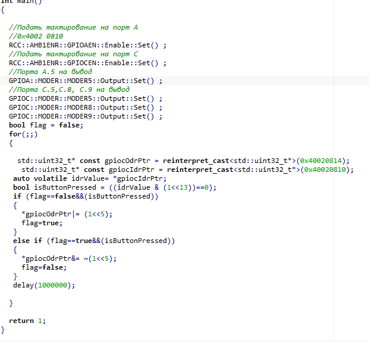
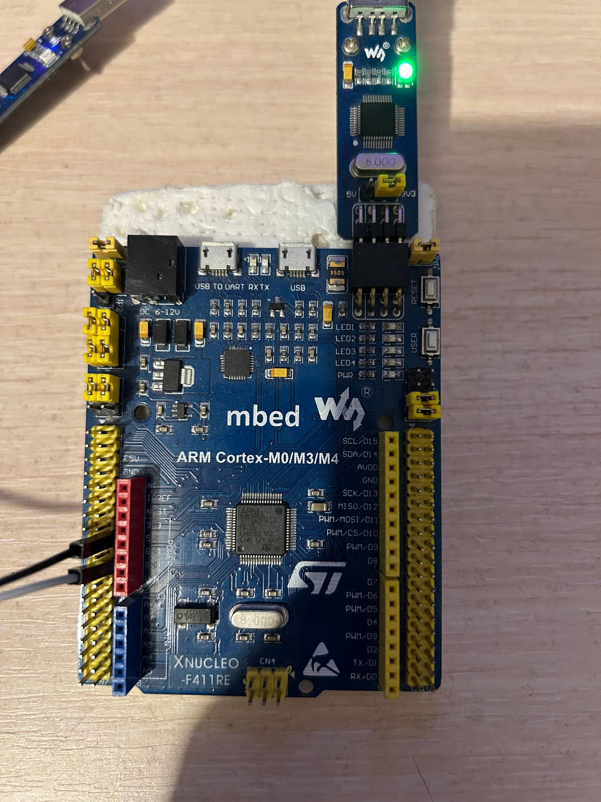
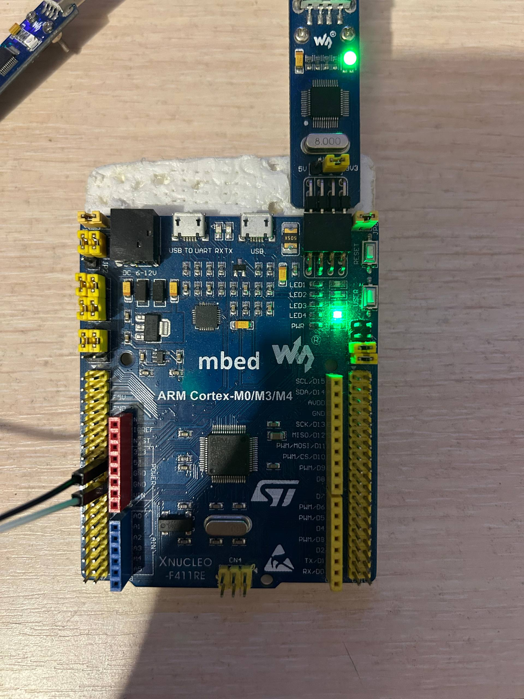

= Лабораторная работа 4

== Жуламанова Арина Маратовна КЭ-413

== Задание

1. Написать код: при нажатии на кнопку загорается диод.
2. Описать типы переменных, преобразования, указатели, ссылки,операции с указателямии, что такое регистр.

=== 1. Код

Код представлен на рисунке 1-2.

Рисунок 1 - Начало кода

Рисунок 2 - Конец кода

На рисунке 3-4 показана работа кода.

Рисунок 3-4 - Работа кода

=== 2. Типы переменных

В программировании переменные — это именные области памяти для хранения данных различных типов. Основные типы переменных:

- Целочисленные (int, short, long, etc.) — хранят целые числа.
- С плавающей точкой (float, double) — для чисел с дробной частью.
- Символьные (char) — для одного символа.
- Логические (bool) — принимают значения true/false.
- Структуры, объединения, классы — сложные типы для группировки данных.

=== 3. Преобразование типов

Преобразование типов — изменение значения из одного типа в другой:

- Неявные (автоматические) — компилятор автоматически преобразует, например, int → float.
- Явные (кастинг) — программист явно указывает преобразование, например, (int) 3.14 → 3.
- Важно контролировать преобразования для предотвращения потерь данных или ошибок.

=== 4. Указатели
 
Указатель — переменная, хранящая адрес другой переменной в памяти.

- Объявление: int *p; — указатель на целое.
- Можно читать/записывать значение по адресу через оператор разыменования *p.
- Используются для динамического выделения памяти, работы с массивами, передачей данных по ссылке.

=== 5. Ссылки

Ссылка — альтернативное имя для уже существующей переменной.

- Объявление: int &ref = var;
- В отличие от указателя, ссылка должна быть инициализирована и не может указывать на NULL.
- Удобны для передачи аргументов в функции без копирования.

=== 6. Операции с указателями

- *p — разыменование (доступ к значению по адресу).
- &var — получение адреса переменной.
- Арифметика указателей: p++ — переход к следующему элементу памяти для данного типа.
- Сравнения указателей (например, p == q).

Операции требуют осторожности, чтобы не выйти за границы выделенной области памяти (чтобы избежать ошибок).

=== 7. Регистр

Регистр — небольшое, очень быстрое хранилище данных внутри процессора.

- Используется для временного хранения значений во время выполнения инструкций.
- Обычно меньше по объему, чем память, но доступ к ним очень быстрый.
- Обозначение зависимо от архитектуры (например, EAX, EBX в x86).
- Может использоваться ключевое слово register в C/C++ для подсказки компилятору хранить переменную в регистре (вообще современный компилятор сам принимает решения).

=== Заключение

Типы переменных, преобразования, указатели и ссылки — ключевые концепции в программировании, обеспечивающие эффективное управление данными и памятью. Понимание различных типов позволяет правильно хранить и обрабатывать информацию, а преобразования помогают безопасно менять форматы данных. Указатели дают прямой доступ к памяти и позволяют создавать гибкие структуры данных, тогда как ссылки упрощают работу с существующими переменными без дополнительной нагрузки. Знание операций с указателями важно для предотвращения ошибок и обеспечения безопасности программ. Регистр процессора — это быстрое хранилище, играющее важную роль в оптимизации выполнения инструкций. В совокупности эти темы образуют фундамент для написания эффективного и корректного кода.
