:toc: 
:toc-title: ОГЛАВЛЕНИЕ
:stem:
:stem: latexmath
:toclevels: 4
:figure-caption: Рисунок
:table-caption: Таблица

:eqnums:

[.text-center]
[discrete]
= Курсовая работа
//

[.text-center]
Разработка устройства определения положения объекта с передачей параметров на ПК
//

include::titul.adoc[]

[.text-center]
Южно-Уральский государственный университет (НИУ)
Высшая школа электроники и компьютерных наук
Кафедра «Информационно-измерительная техника»

[.text-right]
УТВЕРЖДАЮ +
Заведующий кафедрой    +
&#95;&#95;&#95;&#95;&#95;&#95; (А.М. Самодурова) +
&#95;&#95;&#95;&#95;&#95;&#95;&#95;&#95;&#95;&#95;&#95;&#95;&#95;&#95;&#95;&#95;&#95;&#95;&#95; 2026 г.

[.text-center]
*ЗАДАНИЕ НА РАБОТУ* +
на курсовую работу
студенту: +
Жуламановой А.М. и Долгих Е.В.+
группа: КЭ-413

{nbsp} +
{nbsp} +
{nbsp} +

[.text-left]
1. *Дисциплина:* *_Программное обеспечение измерительных процессов._*
2. *Тема работы:* *_Разработка устройства определения положения объекта с передачей параметров на ПК_*
3. *Требования к разработке:*
* Для разработки должна использоваться отладочная плата https://www.waveshare.com/product/arduino-2/boards-kits/nucleo/xnucleo-f411re.htm[XNUCLEO-F411RE]
* Программное обеспечение должно измерять положение платы в пространстве X, Y
** Устройство должно измерять угол наклона и ускорение измеряемого объекта
** Период измерения должен быть 50 ms.
** К измеренным значениям параметров должен быть применен цифровой фильтр вида: +
stem:[tau = int  ((1-e^(-dt/(R*C)), RC > 0 sec), (1, RC<= 0 sec))] +
{nbsp} +
stem:["FilteredValue" = "OldFiltered" + ("Value" - "OldValue") * tau], +
{nbsp} +
где dt -  100 мс; +
Value – текущее нефильтрованное измеренное значение температуры; +
oldValue -  предыдущее фильтрованное значение.
** Для измерения параметров должен использоваться датчик TLE5009
** Получение данных с датчика TLE5009 должно производиться с помощью АЦП

* Вывод значений
** Вывод значений должен осуществляться через USART2 на скорости 19200 кБит/с 
** Период вывода информации раз в 100ms
* Архитектура должна быть представлена в виде UML диаграмм в пакете Star UML
* Приложение должно быть написано на языке С++ с использованием компилятора ARM 8.40.2
* При разработке должна использоваться Операционная Система Реального Времени FreeRTOS и https://github.com/lamer0k/RtosWrapper[С++ обертка над ней]

4. *Перечень вопросов, подлежащих разработке:*
* В ходе работы необходимо разработать архитектуру программного обеспечения в виде диаграммы UML.
* В ходе работы необходимо разработать код программного обеспечения.
** Код должен соответствовать стандарту кодирования https://tproger.ru/translations/stanford-cpp-style-guide/[Стэнфордского университета], см также https://stanford.edu/class/archive/cs/cs106b/cs106b.1158/styleguide.shtml[оригинал]
* Работа программы должна быть продемонстрирована совместно с платой XNUCLEO-F411RE.
* Содержание работы должно соответствовать ГОСТ 19.402–78 «Единая система программной документации. Описание программы».
** Работа должна быть оформлена в формате Asciidoc и выложена на Github
* Описание архитектуры в виде UML диаграмм должно быть оформлено в разделе «Описание логической структуры» -> “Алгоритм программы”.
* Дополнительно к архитектуре, в разделе «Описание логической структуры» -> “Структура программы с описанием функций составных частей и связи между ними” должен быть описан принцип работы программы и взаимодействия разных блоков программы друг с другом.
* Оформление пояснительной записки к курсовой работе в соответствии с СТО ЮУрГУ 04–2008 «Курсовое и дипломное проектирование. Общие требования к содержанию и оформлению».

5. *Календарный план:*
* Сдача этапов выполнения курсовой работы осуществляется строго в соответствии с календарным планом.

[cols="4,3,2"]
|===
|Наименование разделов курсовой работы |Срок выполнения разделов работы |Отметка руководителя о выполнении

|Разработка общей архитектуры программы
|28 марта 2026 г.
|

|Разработка кода каркаса программы
|4 апреля 2026 г.
|

|Разработка детальной архитектуры модуля работы с датчиком
|11 апреля 2026 г.
|

|Разработка кода для модуля работы с датчиком
|11 апреля 2026 г.
|

|Разработка детальной архитектуры модуля работы с USART и блутуз
|25 апреля 2026 г.
|

|Разработка кода для модуля работы  с USART и блютуз
|25 апреля 2026 г.
|

|Разработка детальной архитектуры и кода для оставшихся модулей
|2 мая 2026 г.
|

|Сдача и демонстрация работы устройства
|9 мая 2026 г.
|

|Оформление пояснительной записки к курсовой работе
|20 мая 2026 г.
|

|===

{nbsp} +
{nbsp} +

Руководитель работы:  &#160;&#160;&#160;&#160;&#160;&#160;&#160;&#160;&#160;&#160;&#160;&#160;&#160;&#160;&#160;&#160;&#160;&#160;&#160;&#95;&#95;&#95;&#95;&#95;&#95;&#95;&#95;&#95;&#95;&#95;&#95;&#95;&#95;&#95;&#95;&#95;&#95;&#95;&#95;&#95;&#95;&#95;&#95;&#95;&#95;&#95;&#95;&#95;&#95;&#95;&#95;&#95;&#95;&#95;&#95;&#95;&#95;&#95;&#95;&#95;/С. В. Колодий/ +
[.text-center]
(подпись) +

[.text-left]
Студент &#160;&#160;&#160;&#160;&#160;&#160;&#160;&#160;&#160;&#160;&#160;&#160;&#160;&#160;&#160;&#160;&#160;&#160;&#160;&#160;&#160;&#160;&#160;&#160;&#160;&#160;&#160;&#160;&#160;&#160;&#160;&#160;&#160;&#160;&#160;&#160;&#160;&#160;&#160;&#160;&#160;&#160;&#160;&#95;&#95;&#95;&#95;&#95;&#95;&#95;&#95;&#95;&#95;&#95;&#95;&#95;&#95;&#95;&#95;&#95;&#95;&#95;&#95;&#95;&#95;&#95;&#95;&#95;&#95;&#95;&#95;&#95;&#95;&#95;&#95;&#95;&#95;&#95;&#95;&#95;&#95;&#95;&#95;&#95;/А.М. Жуламанова/ +
[.text-center]
(подпись) +

[.text-left]
Студент &#160;&#160;&#160;&#160;&#160;&#160;&#160;&#160;&#160;&#160;&#160;&#160;&#160;&#160;&#160;&#160;&#160;&#160;&#160;&#160;&#160;&#160;&#160;&#160;&#160;&#160;&#160;&#160;&#160;&#160;&#160;&#160;&#160;&#160;&#160;&#160;&#160;&#160;&#160;&#160;&#160;&#160;&#160;&#95;&#95;&#95;&#95;&#95;&#95;&#95;&#95;&#95;&#95;&#95;&#95;&#95;&#95;&#95;&#95;&#95;&#95;&#95;&#95;&#95;&#95;&#95;&#95;&#95;&#95;&#95;&#95;&#95;&#95;&#95;&#95;&#95;&#95;&#95;&#95;&#95;&#95;&#95;&#95;&#95;/Е.В. Долгих/ +
[.text-center]
(подпись) +

<<<

[.text-left]
== 1. Анализ требований к разработке

Курсовая работа посвящена разработке устройства и программы, осуществляющие определение углового положения и передачей информации через Bluetooth.

Цель работы -- разработка и кодирование программы в соответствии со стандартами и документацией.

Задачи работы:

* Провести аналитический обзор компонентов устройства и их кодирование;
* Разработать архитектуру программы;
* Создать код программы, осуществляющий работу устройства.

=== 1.1 Аппаратная платформа

В качестве базовой платформы используется отладочная плата XNUCLEO-F411RE, построенная на микроконтроллере STM32F411RE. Данный микроконтроллер относится к семейству STM32F4, которое базируется на ядре ARM® Cortex®-M4 с поддержкой операций с плавающей запятой (FPU) . Основные характеристики:

Плата имеет ряд особенностей, которые подходят для разработки устройства:

. Наличие АЦП (12 разрядный)
. Поддержка USART
. Большое количество вспомогательных материалов в связи с популярностью ядра ARM Cortex-M4

Операционная система реального времени FreeRTOS является не только требованием к выполнению задания, но и значительным упрощением в работе с АЦП и дальнейшими преобразованиями.

=== 1.2 Фильтр

Указанный фильтр представляет собой цифровую реализацию фильтра низких частот первого порядка. Он простой в понимании и удобный в использовании, т.к. займет всего несколько строк кода и имеет всего один коэффициент, который нужно выбрать.

В соответствии с типом датчика следует выбрать RC примерно равным dt, т.к. тогда фильтр будет давить случайные выбросы, но при этом оперативно реагировать на изменяющееся значение.

=== 1.3 Датчик положения TLE5009

Датчик TLE5009 производства Infineon Technologies представляет собой магниторезистивный (GMR) датчик угла поворота . Принцип его работы основан на измерении компонент магнитного поля с использованием элементов с гигантским магниторезистивным эффектом (iGMR) .

Основные характеристики датчика:

* Измеряемый диапазон угла: 0 – 360°;
* Выходные сигналы: аналоговые синусный и косинусный;
* Амплитуда выходных сигналов: оптимизирована для питания 3.3 В или 5 В;
* Температурный диапазон: от -40°C до 125°C;
* Выходы: дифференциальные пары SIN_P/SIN_N и COS_P/COS_N; 
* Устойчивость к изменению воздушного зазора.

Датчик обеспечивает измерение угла с высокой точностью (типовое значение погрешности 0.3°), что делает его пригодным для определения положения объекта в пространстве .

Связь датчика с микроконтроллером: Поскольку TLE5009 предоставляет аналоговые сигналы, его подключение осуществляется через встроенные АЦП микроконтроллера. Выходное напряжение датчика масштабировано для использования полного динамического диапазона АЦП при питании 3.3 В, что упрощает согласование уровней .

.Алгоритм вычисления угла с коррекцией
[cols="1,2,2", options="header"]
|===
| Шаг | Действие | Формула
| 1 | Измерение сырых сигналов | X_raw, Y_raw (с АЦП)
| 2 | Вычитание смещения (Offset) | X₁ = X_raw - O_X, Y₁ = Y_raw - O_Y
| 3 | Нормализация амплитуд | X₂ = X₁ / A_X, Y₂ = Y₁ / A_Y
| 4 | Поправка на неортогональность | Y₃ = (Y₂ - X₂·sin φ) / cos φ
| 5 | Вычисление угла | α = atan2(Y₃, X₂)
|===

Алгоритм расчета угла можно так же увидеть на рисунке.

.Алгоритм расчета угла
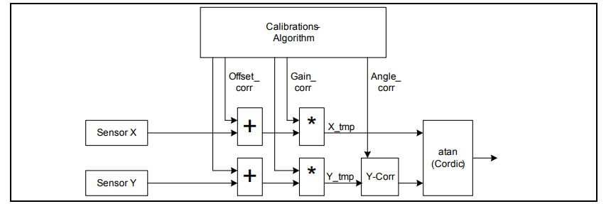

==== ПРАВКИ

В связи с неимением нужного датчика была произведена замена -- будем использовать модель AS5600. Это датчик, который способен работать как в формате аналогового выхода, так и в формате программируемого датчика.

Формула нахождения угла простая:

stem:[Ang = Code_(ADC) * 360 / 4095]

=== 1.4 АЦП

АЦП микроконтроллера STM32F411RE используется для оцифровки:

* Синусного и косинусного сигналов с датчика TLE5009;

Ключевые параметры АЦП:

* Разрядность: 12 бит (значения от 0 до 4095);
* Количество каналов: до 16;
* Режим работы: единичное преобразование группы 4 инжекторных каналов;
* Время выборки: настраиваемое.

Подключение будет осуществляться через порты A0-A3 (в соответствии с документом на плату это пины PA0, PA1, PA4, PB0, в соответствии с Pinouts and Pin Discription -- ADC1_x, x ∊ (0, 1, 4, 8)).

.Регистры для работы с АЦП
[cols="1,5,5,5,10"]
|===

|Порядок
|Регистр
|Ячейка/бит
|Значение
|Описание

|1 
|RCC_AHB1ENR
|GPIOAEN GPIOBEN
|1
|Подключение регистров А и B к тактированию

|2
|GPIOх_MODER
|MODER_x
|11
|Режим аналоговый вход для портов PA0, PA1, PA4, PB0

|3
|RCC_APB2ENR
|ADC1EN
|1
|Подключаем тактирование на АЦП

|4
|ADC_JSQR
|JL, JSQ1-4
|11, channel_x
|Запись количества преобразований в JL и с каких выводов будут производиться преобразования. Преобраование будет начинаться с JSQ4, пусть для JSQ1-4 будет порядок выводов 8, 4, 1, 0 (будем снимать значения в порядке А0-А3)

|5
|ADC_SMPR2
|SMP0-3
|Cycles84
|Поканальное определние времени дискретизации (биты для SMP0-SMP3)

|6
|ADC_CR2
|ADON, JSWSTART
|1, 1
|Биты включения АЦП (ADON), запуска измерений (JSWSTART, reset = 0)

|7
|ADC_SR
|JEOC
|reset = 0
|Регистр статуса измерения, бит JEOC устанавливается при окончании преобразования. Сбрасывается программно. Проверяем установку этого бита прежде чем преобразовывать данные

|8
|ADC_DR1-4
|-
|readonly
|Регистр данных 

|===

Пункты 1-5 следует настроить 1 раз. Пункты 6-8 используем каждый раз, когда истекает 50 мс:

[.text-center]
JSWSTART -> проверка JEOC = 1 -> чтение ADC_DR1-4 -> сброс JEOC.

Так как будет использоваться RTOS, то будет применен режим одиночного преобразования совместно с функцией управления задачами TaskDelay (в обертке она обозначена как Wait()).

Более того -- не потребуется использование DMA, т.к. для каждого канала свой регистр данных, так как, так как в соответствии с ТЗ время одного измерения 50 мс (очень редко, с частотой всего 20 Гц).

==== ПРАВКИ 

Так же в связи с использованием другого датчика потребуется внести правки в настройку АЦП. Пункты 2, 4, 5, 8 таблицы 3 будут затрагивать только 1 порт:

* количество конверсий JL = 1
* назначаем для JSQ4 канал PA0
* Режим аналоговый выход только для PA0
* Время дискретизации для 1 канала
* Читаем только первый регистр данных

=== 1.5 USART и Bluetooth

Для связи с персональным компьютером используется интерфейс USART2. USART (Universal Synchronous Asynchronous Receiver Transmitter) — универсальный синхронно-асинхронный приёмопередатчик, широко применяемый в микроконтроллерах STM32.

Параметры настройки:

[cols="3,4,4"]
|===
|Параметр | Значение | Обоснование

|Скорость
|19200 бит/с
|Задано в ТЗ

|Формат данных
|8 бит данных, 1 стоп-бит, без чётности
|Стандартный формат

|Режим работы	
|Transmit Only (только передача)	
|Достаточно для отправки данных на ПК
|===

Для работы USART2 на плате XNUCLEO-F411RE используются следующие выводы:

* TX (передача) — PA2;
* RX (приём) — PA3;

В данном проекте используется только передача данных (TX), так как устройство только отправляет без получения команд.

Рассмотрим регистры USART и другие необходимые регистры для работы с ним. 

.Порядок включения
[cols="1,3,7,11"]
|===
|Порядок |Параметр | Регистр | Пояснение

|1
|Тактирование
|RCC_APB1ENR, RCC_AHB1ENR
|USART от APB1, PA2 от AHB1

|2
|Режим порта 
|GPIOA_MODER
|Режим альтернативной функции (10)

|3
|Тип вывода
|GPIOA_OTYPER
|режим push-pull обычно используется для вывода TX

|4
|Альтернативная функция
|GPIOA_AFRL
|AF7 -- для USART (0111)

|5
|Разрешение передачи 
|USART_CR1
|TE бит  

|6
|Стоп-бит
|USART_CR2
|STOP бит

|7
|Оверсамплинг и длина слова
|USART_CR1
|OVER8 несколько раз считывает бит информации (16 или 8 раз), бит М определяет 8 (0) или 9 (1) бит

|8
|Скорость
|USART_BRR
|Расчет по формулам (1-3)

|9
|Включение USART
|USART_CR1
|Включается битом UE

|10
|Прерывания
|NVIC_ISER0
|Разрешение глобальных прерываний TIM2 (бит 28)

|11
|Прерывание по переполнению
|TIM2_DIER
|Чтобы генерировалось событие для обработчика прерываний ставим в бит UIE 1

|12
|Делитель частоты
|TIM2_PSC = 0
|Оставим делитель 1

|13
|Период таймера
|TIM2_ARR
|Для 100 мс требуется записать значение (16'000'000/10-1), т.к. тактирование от внутреннего источника 16 МГц

|14
|Сброс счетчика и включение таймера
|TIM2_CNT TIM2_CEN
|Сброс счетчика для корректности запуска

|15
|Проверка события
|TIM2_SR
|Проверяем бит UIF, сбрасываем и начинаем передавать посылку

|16
|Проверка буфера
|USART2_SR
|Ждем, когда бит TXE станет пустым (1)

|17
|Передача посылки
|USART2_DR
|Записываем в буфер данные для отправки. Если это самая первая передача, то следует отчистить его перед тем как запускать TE

|===

* USART2 находится на шине APB1, поэтому для включения USART2 программируем бит EN регистра RCC_APB1ENR в 1.

* Так как выводы TX и RX находятся на GPIOA, то следует включить тактирование GPIOA в регистре RCC_AHB1ENR.

* Для вывода TX (PA2) настроить режим, тип выхода, скорость и выбрать номер альтернативной функции AF7 в соответствии с USART2 (регистры MODER, OTYPER, OSPEEDR, PUPDR, AFRL для GPIOA)

* Регистры CR1 (включение, битность, parity, передатчик/приемник), CR2 (стоп-биты) и BRR (делитель для Baud Rate, т.е. регистр для задачи необходимой скорости по ТЗ).

** Длинна сообщения может быть 8 или 9 бит, выбор программируется благодаря записи в бит M в регистре USART_CR1. В этом же регистре включается TX и сам USART (бит UE).

** С помощью BRR требуется задать скорость 19200 б/с. Для оверэсмплинга = 16 найдем мантиссу и целую часть.

\begin{equation} USARTDIV = \frac{f_{CK}}{baud \times 16} = \frac{16'000'000}{19'200 \times 16} = 52.083 \end{equation}

\begin{equation} DivMantissa = 52 \end{equation}

\begin{equation} DivFraction = 0.083 \times 16 = 1.33 = 0x1 \end{equation} 

Все в разы облегчается, так как USART2 выведен на плату как порт USB to UART. Таким образом мы сможем подключить к плате USB адаптер с *Bluetooth модулем*.

=== Выводы по аналитическому обзору

На основе проведённого анализа можно сделать следующие выводы:

* Выбор аппаратной платформы (XNUCLEO-F411RE + TLE5009) является технически обоснованным и достаточным для решения поставленной задачи. Микроконтроллер имеет необходимую производительность и периферию, датчик обеспечивает требуемую точность измерения угла;
* Передача данных через USART2 со скоростью 19200 бит/с обеспечивает надёжную связь с ПК. Период передачи 100 мс гарантирует своевременное обновление данных на экране компьютера;
* Разработка в соответствии со стандартом кодирования Стэнфордского университета обеспечит читаемость и поддерживаемость кода, что особенно важно при командной разработке.

Имеем устройство следующего вида:

.Функциональная схема

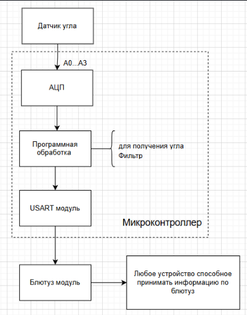

== 2. Архитектура

Архитектура программного обеспечения разрабатываемого устройства построена по многоуровневому принципу и включает четыре основных уровня: задачи приложения (Tasks), бизнес-логика (ApplicationImplementation), интерфейсы-контракты (appContracts) и уровень абстрактного аппаратного обеспечения (AbstractHardware).

.Архитектура проекта
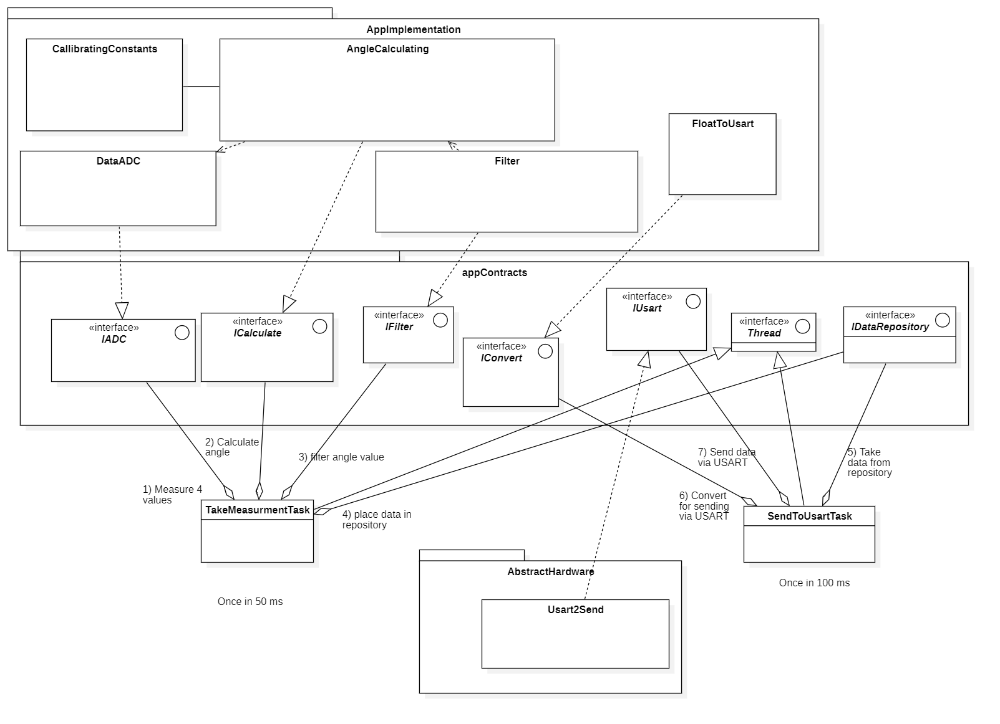

=== 2.1 Задачи (Tasks)

. TakeMeasurementTask — задача измерения, запускаемая с периодом 50 миллисекунд. Данная задача выполняет следующие функции:

* Измерение четырёх значений с датчика TLE5009 через интерфейс IADC;

* Вычисление угла с использованием интерфейса ICalculate;

* Фильтрацию полученного значения через интерфейс IFilter;

* Помещение обработанных данных в репозиторий.

. SendToUsartTask — задача отправки данных, запускаемая с периодом 100 миллисекунд. Данная задача:

* Забирает отфильтрованные данные из репозитория через IDataRepository;

* Преобразует данные в формат, пригодный для передачи по USART, используя интерфейс IConvert;

* Отправляет преобразованные данные через интерфейс IUsart.

=== 2.2 Интерфейсы (AppContracts)

Уровень определяет абстрактные интерфейсы, служащие для описания необходимых функций.

.Интерфейсы приложения (appContracts)
[cols="1,2", options="header"]
|===
| Интерфейс | Назначение
| IADC | Абстракция АЦП 
| ICalculate | Абстракция вычисления угла с калибровкой
| IFilter | Абстракция цифрового фильтра
| IConvert | Абстракция преобразования float → массив байт
| IUsart | Абстракция USART 
| IThread | Абстракция потока RTOS
| IDataRepository | Абстракция хранилища данных между задачами
|===

=== 2.3 Реализация интерфейсов (ApplicationImplementation)

Данный уровень содержит классы, реализующие алгоритмы обработки данных.

* CalibrationConstants — класс, хранящий калибровочные константы датчика TLE5009: амплитуды синусного и косинусного сигналов, смещения и поправку угла.

* DataADC — класс, представляющий структуру для получения и хранения сырых данных, полученных с АЦП (четыре значения).

* AngleCalculating — класс, выполняющий вычисление угла на основе сырых данных АЦП с учётом калибровочных констант. Данный класс реализует интерфейс ICalculate и использует данные из DataADC и CalibrationConstants.

* Filter — класс, реализующий цифровой фильтр нижних частот первого порядка (согласно техническому заданию) для работы с данными, полученными с помощью класса AngleCalculating. Класс реализует интерфейс IFilter.

* FloatToUsart — класс, преобразующий значение угла из формата с плавающей запятой в массив байт, пригодный для передачи по USART. Класс реализует интерфейс IConvert.

=== 2.4 AppHardware

Usart2Send — класс, реализующий низкоуровневую работу с периферийным модулем USART2 микроконтроллера. Данный класс реализует интерфейс IUsart и выполняет непосредственную отправку байтов через регистр USART_DR.

=== 2.5 Взаимодействия компонентов

Агрегации задач:

. TakeMeasurementTask использует ссылки на созданные данные из интерфейсов: IADC, ICalculate, IFilter, IDataRepository;

. SendToUsartTask использует ссылки на созданные данные: IConvert, IUsart, IDataRepository.

Задачи так же наследуют IThread через Thread.

Реализация интерфейсов:

. AngleCalculating реализует ICalculate;

. Filter реализует IFilter;

. FloatToUsart реализует IConvert;

. Usart2Send реализует IUsart.

Ассоциации (использование данных):

. AngleCalculating использует данные, полученные через DataADC, и использует CalibrationConstants.

=== 2.6 Поток данных, временная диаграмма

.Временная диаграмма процесса
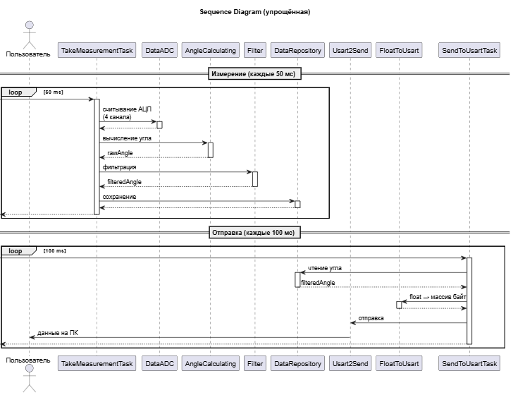

. Измерение (50 мс): TakeMeasurementTask → IADC → сырые данные → DataADC → AngleCalculating (через ICalculate) → угол → Filter (через IFilter) → отфильтрованный угол → репозиторий (через IDataRepository).

. Отправка (100 мс): SendToUsartTask → репозиторий (через IDataRepository) → отфильтрованный угол → FloatToUsart (через IConvert) → массив байт → Usart2Send (через IUsart) → USART2 → Bluetooth → ПК.

Программа будет состоять из двух задач, TakeMeasurementTask и SendToUsartTask.

Первая задача считывает данные канала с АЦП (DataADC) и рассчитывает с их помощью угол (AngleCalculating). Затем вызывает функцию фильтрации (из Filter) и возвращает значение отфильтрованного угла, сохраняя в репозиторий (DataRepository).

Вторая задача имеет доступ в репозиторий, откуда забирает значение угла для преобразования его в удобный для передачи формат по Usart (FloatToUsart). Затем задача отправляет данные по Usart (Usart2Send), откуда данные попадают на ПК.

Задача съема данных всегда выше приоритетом, т.к. это впоследствии влияет на результат обработки данных. Для обеспечения целостности данных требуется поставить блокировку на запись и чтение из репозитория (mutex).

== 3. Дизайн

Ниже представлен дизайн

.Дизайн
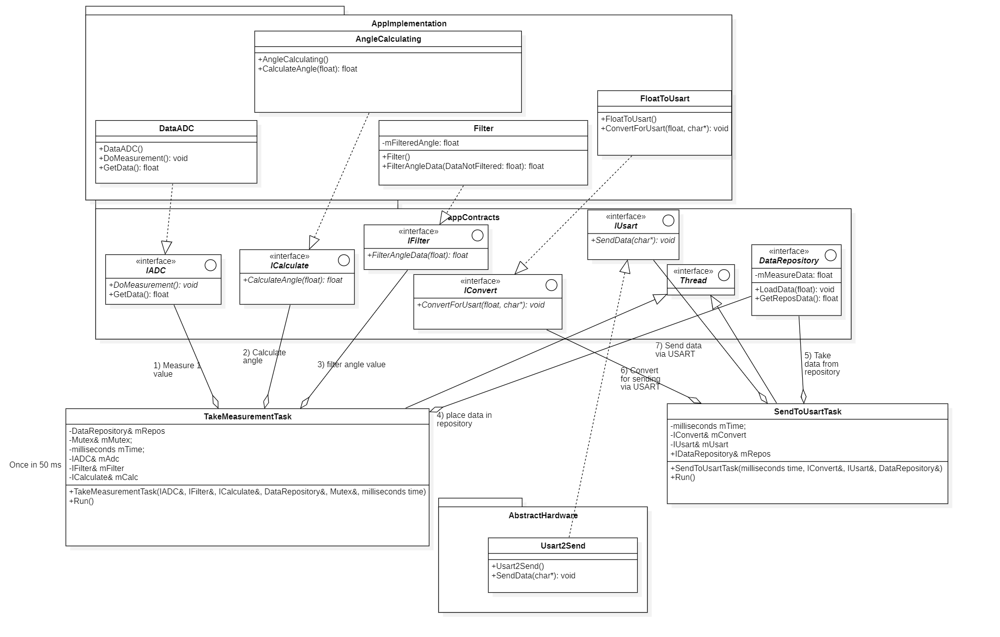 

=== 3.1 IADC и IDataADC

Этот модуль имеет 2 функции:

* *void DoMeasurement()::* не возвращает никаких данных, только производит измерение.

* *float GetData()::* считывает код АЦП из регистра данных и возвращает значение в формате float.
 

IADC - интерфейс, отвечает за снятие данных, объявляет функции для снятия данных и их возвращения.

.IADC
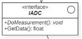 

DataADC - реализует функции интерфейса IADC, переопределяя виртуальные функции.

.DataADC
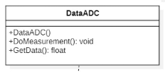

=== 3.2 ICalculate и AngleCalculating

* *float CalculateAngle(float buffer)* -- метод объявляется в интерфейсе и реализуется в классе. Метод пересчитывает код АЦП и возвращает значение угла в градусах.

ICalculate - интерфейс, отвечающий за расчет угла из кода АЦП.

.ICalculate
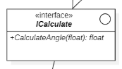 

* *AngleCalculating* - реализует функции интерфейса ICalculate.

.AngleCalculating
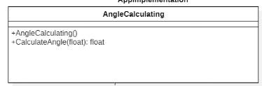 

=== 3.3 IFilter и Filter

* *float FilterAngleData(DataNotFiltered: float)* -- метод объявляется в интерфейсе и реализуется в классе. Принимает нефильтрованное значение и возвращает отфильтрованное.
* *float mFilteredAngle* -- поле, хранящее последнее отфильтрованное значение. Нужно для работы.
* *Filter()* -- конструктор класса. Нужен для инициализации начального значения поля mFilteredAngle нулем.

*IFilter* - интерфейс, отвечает за фильтрацию данных угла

.IFilter
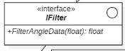 

*Filter* - реализует функции интерфейса IFilter

.Filter
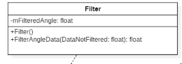 

=== 3.4 IConvert и FloatToUsart

* **void ConvertForUsart(float filteredValue, char* bufferValue)** -- метод объявлен в интерфейсе и реализован в классе. Принимает значение угла и конвертирует его в строку для отправки по USART.

*IConvert* - интерфейс, отвечает за преобразование типа данных угла для передачи.

.IConvert
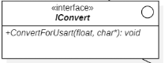 

*FloatToUsart* - класс, реализует функции интерфейса IConvert (преобразование в строку).

.FloatToUsart
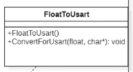 

=== 3.5 IUsart и Usart2Send

* **void SendData(char* buffer) const** -- метод объявлен в интерфейсе и реализован в классе. Реализует полный цикл отправки строки по USART с использованием регистров буфера данных и бита статуса регистра буфера данных.

*IUsart* - интерфейс, отвечает за отправку данных по USART.

.IUsart
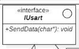 

*Usart2Send* - класс, реализует функции интерфейса IUsart для usart2

.Usart2Send
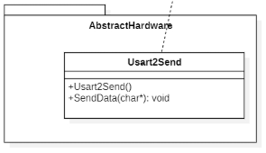 

=== 3.6 DataRepository

*float GetData() const* -- метод получения данных репозитория, возвращает значение mData;
*void LoadData(float data)* -- метод, записывающий в поле mData класса значение угла; *float mData* -- поле хранит данные между двумя тасками.

*DataRepository* - класс, содержит в себе промежуточные значения для взаимодействия между задачами.

.DataRepository
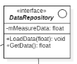 

== Результаты работы

=== Краткая характеристика реализации

В ходе выполнения курсовой работы разработана программа для микроконтроллера STM32F411RE (отладочная плата XNUCLEO-F411RE), реализующая следующие функции:

* Измерение аналогового сигнала с датчика положения AS5600 (замена TLE5009) через АЦП;
* Вычисление угла поворота в градусах;
* Цифровая фильтрация полученного значения (ФНЧ первого порядка);
* Синхронизированное хранение данных между задачами с использованием мьютекса;
* Периодическая отправка отфильтрованного угла по интерфейсу USART2 (скорость 19200 бит/с);
* Работа под управлением ОСРВ FreeRTOS (через C++ обёртку OsWrapper).

Работоспособность программы подтверждена экспериментально (фото). Программа соответствует требованиям технического задания.

На рисунке ниже представлен датчик и магнит.

.Конструкция датчика с магнитом
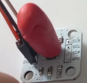 

Датчик подключен к плате через порт питания 3,3 В, землю и АЦП.

Порядок работы:

. Запуск кода (Рисунок 18);

. В программе SerialTest (помогает распознать данные с АЦП) выбираем порт, выставляем скорость 19200 по заданию.

. Смотрим результат (Рисунок 19)

.Запущена передача данных, код работает
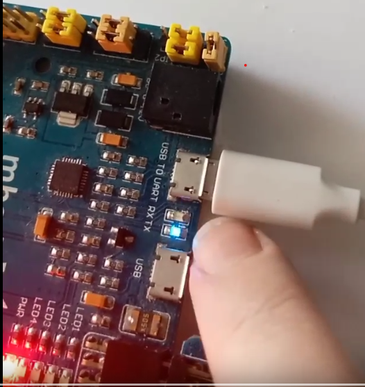

.Результатик в программе
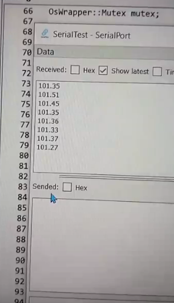

При повороте по часовой стрелке значение увеличивается, при повороте против часовой стрелки значение уменьшается.

[bibliography]
== Библиографический список

. [[ссылке]] Документация по датчику https://static.chipdip.ru/lib/293/DOC012293640.pdf[здесь].
. Документация по датчику-замене https://2150692.ru/files/as5600.pdf[здесь].